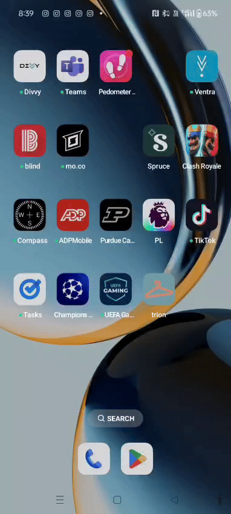

# AR Virtual Try-On

This is a Unity project that uses Google's MediaPipe framework through homuler's Unity Mediapipe plugin to create a real-time, augmented reality virtual try-on experience. The application tracks a user's body pose from a webcam feed and overlays a 3D T-shirt model onto their torso, adjusting its position, rotation, and scale to fit.

## Core Features

-   **Real-time Pose Detection**: Detects pose of a human.
-   **Dynamic Fitting**: Adjusts the 3D model's transform (position, rotation, scale) in real-time to match the user's movement and orientation.

## Demo - Version 1.0

This first version establishes the core try-on functionality.

Example of version 1.0.0 on phone:

Note: will update video for major updates

## Technology Stack

-   **Engine**: Unity 2022.3 or newer
-   **Framework**: Homuler's MediaPipe Unity Plugin
